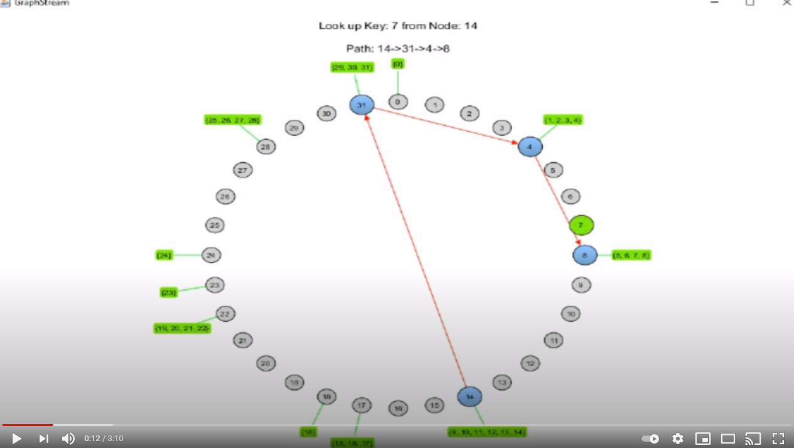

# Distributed Hash Table Lookup System
## Introduction
Hello!
This was a project that I worked on in my Distributed Systems class. The purpose is to visually show how a 
peer-to-peer network can efficiently resolve queries. To give you an idea of what the heck that means, here is an 
example. Suppose you had a file sharing network composed of tens of thousands of users and one of these users was 
looking for a file. Asking each user of this network in a linear fashion would take some time. Instead, we can use the
Chord protocol to find what we are looking for in logarithmic time (really good!). More info about this protocol can be
found here: https://en.wikipedia.org/wiki/Chord_(peer-to-peer) This project also uses GraphStream, a library used for 
modeling and analyzing graphs. This library is super cool! More info can be found here: https://graphstream-project.org/
Thanks for reading!
## To Run
*dht.exe* produces output that the *dht.class* uses in order display the lookup system in action. Redirect this output
into a file called *dht.dgs* and run *dht.class*

    ./dht > dht.dgs
    java -cp "GraphStreamLibrary/gs-algo-1.3/gs-algo-1.3.jar;GraphStreamLibrary/gs-core-1.3/gs-core-1.3.jar;GraphStreamLibrary/gs-ui-1.3/gs-ui-1.3.jar;" dht
## To Compile and Run
If you wanted to both compile and run the program, here are the commands that you should run.

    gcc -Wall dht.c -o dht -lm
    ./dht > dht.dgs
    javac -cp "GraphStreamLibrary/gs-algo-1.3/gs-algo-1.3.jar;GraphStreamLibrary/gs-core-1.3/gs-core-1.3.jar;GraphStreamLibrary/gs-ui-1.3/gs-ui-1.3.jar;" dht.java
    java -cp "GraphStreamLibrary/gs-algo-1.3/gs-algo-1.3.jar;GraphStreamLibrary/gs-core-1.3/gs-core-1.3.jar;GraphStreamLibrary/gs-ui-1.3/gs-ui-1.3.jar;" dht
## Video Demonstration
If you click on the thumbnail below, you will be redirected to a Youtube video showcasing how the lookup system works.
These lookups are done with 32, 64, and 128 nodes. I'm not a video editor, so hopefully it isn't too blurry.

